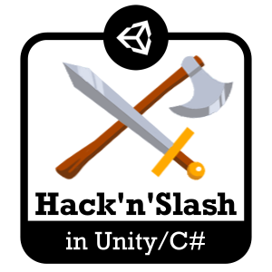

# [Unity/C#] Making a Hack'n'slash

**Mina Pêcheux - Since March 2022**

This repository contains the code for my on-going series of tutorials on how to make a hack'n'slash game in the well-known game engine Unity! Throughout this series of tutorials, I explore C# scripting for games, Unity physics, finite state machines, animation, 3D model imports...

You can find the list of all tutorials [on Medium](https://mina-pecheux.medium.com/making-a-hackn-slash-game-in-unity-c-6ec315e75816), or right below:

<ul class="">
<li>Tutorial #1: <a rel="noopener follow" href="https://mina-pecheux.medium.com/making-a-hackn-slash-1-moving-and-following-our-hero-a9121b725c94"><strong>Moving and following our hero</strong></a></li>

<li>Tutorial #2: <a rel="noopener follow" href="https://mina-pecheux.medium.com/making-a-hackn-slash-2-setting-up-cross-platform-inputs-cd43174c11c9"><strong>Setting up cross-platform inputs</strong></a></li>
  
<li>Tutorial #3: <a rel="noopener follow" href="https://mina-pecheux.medium.com/making-a-hackn-slash-3-importing-a-3d-model-animating-our-hero-1-2-f23b37f36359"><strong>Importing a 3D model & animating our hero 1/2</strong></a></li>
  
<li>Tutorial #4: <a rel="noopener follow" href="https://mina-pecheux.medium.com/making-a-hackn-slash-4-importing-a-3d-model-animating-our-hero-2-2-15377f0a3315"><strong>Importing a 3D model & animating our hero 2/2</strong></a></li>
  
<li>Interlude #1: <a rel="noopener follow" href="https://medium.com/codex/hackn-slash-interlude-1-automating-your-unity-imports-cd2ae594bf5c"><strong>Automating your Unity imports</strong></a></li>
  
<li>Tutorial #5: <a rel="noopener follow" href="https://mina-pecheux.medium.com/making-a-hackn-slash-5-introducing-combo-attacks-45ce61eb9931"><strong>Introducing combo attacks</strong></a></li>
  
<li>Tutorial #6: <a rel="noopener follow" href="https://mina-pecheux.medium.com/making-a-hackn-slash-6-hitting-enemies-733ef33c0b36"><strong>Hitting enemies</strong></a></li>
  
<li>Tutorial #7: <a rel="noopener follow" href="https://mina-pecheux.medium.com/making-a-hackn-slash-7-using-scriptable-objects-and-prefabs-351350514377"><strong>Using Scriptable Objects and Prefabs</strong></a></li>
  
<li>Tutorial #8: <a rel="noopener follow" href="https://mina-pecheux.medium.com/making-a-hackn-slash-8-implementing-a-basic-ai-using-a-finite-state-machine-1-2-be45ac71c73b"><strong>Implementing a basic AI using a Finite State Machine 1/2</strong></a></li>
  
<li>Tutorial #9: <a rel="noopener follow" href="https://mina-pecheux.medium.com/making-a-hackn-slash-9-implementing-a-basic-ai-using-a-finite-state-machine-2-2-a525402dfdb6"><strong>Implementing a basic AI using a Finite State Machine 2/2</strong></a></li>
  
<li>Tutorial #10: <a rel="noopener follow" href="https://mina-pecheux.medium.com/making-a-hackn-slash-10-showing-damage-popups-1-2-80f4003abffa"><strong>Showing damage popups 1/2</strong></a></li>
  
<li>Tutorial #11: <a rel="noopener follow" href="https://mina-pecheux.medium.com/making-a-hackn-slash-11-showing-damage-popups-2-2-e4e6e59ce370"><strong>Showing damage popups 2/2</strong></a></li>
  
<li>Tutorial #12: <a rel="noopener follow" href="https://mina-pecheux.medium.com/making-a-hackn-slash-12-setting-up-an-inventory-panel-317061819206"><strong>Setting up an inventory panel</strong></a></li>
  
<li>Tutorial #13: <a rel="noopener follow" href="https://mina-pecheux.medium.com/making-a-hackn-slash-13-creating-items-filling-the-inventory-stacking-43e86c5c43fd"><strong>Creating items, filling the inventory & stacking</strong></a></li>
  
<li>Tutorial #14: <a rel="noopener follow" href="https://mina-pecheux.medium.com/making-a-hackn-slash-14-creating-an-in-game-menu-adding-item-details-786e37b06e16"><strong>Creating an in-game menu, adding item details...</strong></a></li>

<li>Tutorial #15: <a rel="noopener follow" href="https://mina-pecheux.medium.com/making-a-hackn-slash-15-dropping-items-showing-item-selection-5d5fb9e93c02"><strong>Dropping items, showing item selection…</strong></a></li>

<li>Tutorial #16: <a rel="noopener follow" href="https://medium.com/codex/making-a-hackn-slash-16-on-with-the-inventory-and-the-equipment-systems-7637c4ffafa3"><strong>On with the inventory and the equipment systems!</strong></a></li>

<li>Tutorial #17: <a rel="noopener follow" href="https://mina-pecheux.medium.com/making-a-hackn-slash-17-adding-a-loot-system-1-2-ff8e5184f5a9"><strong>Adding a loot system 1/2</strong></a></li>

<li>Tutorial #18: <a rel="noopener follow" href="https://mina-pecheux.medium.com/making-a-hackn-slash-18-adding-a-loot-system-2-2-d3a6d4e64c93"><strong>Adding a loot system 2/2</strong></a></li>

<li>Tutorial #19: <a rel="noopener follow" href="https://mina-pecheux.medium.com/making-a-hackn-slash-19-showing-cross-platform-input-displays-68331f690489"><strong>Showing cross-platform input displays</strong></a></li>

<li>Tutorial #20: <a rel="noopener follow" href="https://mina-pecheux.medium.com/making-a-hackn-slash-20-equipping-our-items-ccd51d9e65f1"><strong>Equipping our items</strong></a></li>

</ul>
